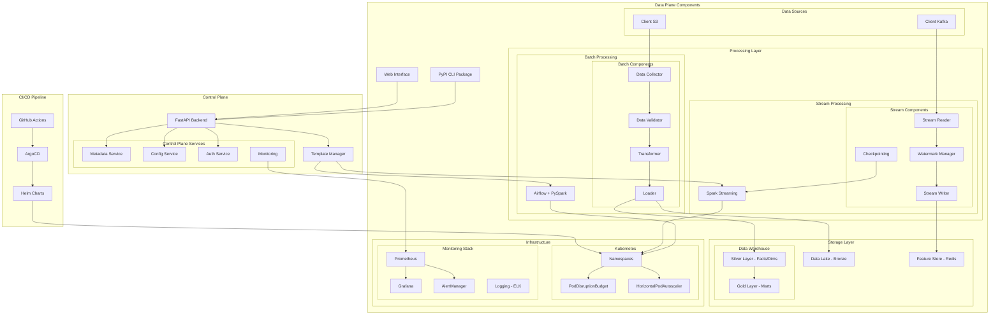

# Enterprise Data Platform System Design

## Overview

This document outlines the system design for our Enterprise Data Platform, a comprehensive solution designed to process both batch and streaming data at scale. The platform follows a control plane and data plane architecture to ensure a clear separation of concerns between platform management and data processing.

## Project Objectives

We are building an enterprise-grade data processing platform that enables:

1. High-volume batch data processing (4TB+ per day)
2. High-volume streaming data processing (1.2B+ records per hour)
3. Structured, robust and reusable pipelines build using airflow and pyspark structured streaming
4. Self-service pipeline creation via API and CLI tools
5. Performance optimized pipelines where compute resources are managed by the client at scale

## Success Criteria

The platform will be considered successful when it achieves:

- Batch processing of 4TB data per day with efficient resource utilization
- Streaming pipeline capable of ingesting 1 billion rows in approx 1 hour
- Self-service pipeline creation with minimal intervention from platform team
- Well-defined data model with fact/dimension tables in the data warehouse
- Comprehensive CI/CD pipeline with automated testing and deployment
- Robust monitoring and alerting for both platform and data pipelines
- Clear separation between control plane (management) and data plane (execution)

## Architecture Components

Our architecture is divided into two primary sections: Control Plane and Data Plane.

### Control Plane Components

The Control Plane houses the management and orchestration services that enable platform operations without direct access to client data.

#### 1. FastAPI Backend

A high-performance REST API service that serves as the central communication hub. It provides endpoints for:
- Pipeline management (create, read, update, delete)
- Template management
- Status monitoring
- Authentication and authorization

#### 2. Template Manager

This component translates pipeline definitions into executable configurations:
- Generates Airflow DAGs for batch processing
- Creates Spark operator configurations for streaming pipelines
- Manages parameter substitution using Jinja templates
- Handles versioning of pipeline definitions

#### 3. Metadata Service

Manages metadata about pipelines, data sources, and execution history:
- Tracks pipeline execution status and history
- Stores data schema information
- Manages data lineage tracking
- Provides APIs for metadata queries

#### 4. Configuration Service

Manages platform and pipeline configuration settings:
- Stores environment-specific configurations
- Handles configuration versioning
- Provides parameter validation
- Supports configuration inheritance and overrides

#### 5. Authentication Service

Handles security and access control:
- Implements role-based access control (RBAC)
- Manages API authentication
- Integrates with client identity providers
- Issues and validates JWT tokens

#### 6. Monitoring Service

Centralizes observability concerns:
- Collects metrics from all platform components
- Defines alerting rules and thresholds
- Provides logging aggregation interfaces
- Tracks pipeline health and performance

### Data Plane Components

The Data Plane encompasses the execution environment and resources provided by the client, where actual data processing occurs.

#### 1. User Interfaces

##### PyPI CLI Package
A command-line tool that allows users to:
- Define and deploy pipelines with simple commands
- Set pipeline parameters and configurations
- Monitor pipeline execution status
- Manage pipeline lifecycle

##### Web Interface
A user-friendly UI for pipeline management:
- Pipeline creation wizard with form-based configuration
- Visual DAG representation for batch pipelines
- Real-time monitoring dashboards
- Pipeline execution history and logs

#### 2. Data Sources

##### S3 Data Lake
Storage for raw and processed batch data:
- Holds structured and semi-structured data files
- Organized in optimized formats (Parquet, ORC)
- Configured with appropriate partitioning strategies

##### Kafka Topics
Message broker for real-time data streaming:
- Maintains ordered message queues by topic
- Provides buffering for stream processing
- Enables parallelism through partitioning

#### 3. Processing Layer

##### Batch Processing
Based on Airflow and PySpark:
- Orchestrates complex data workflows with dependencies
- Executes distributed PySpark jobs for large-scale processing
- Handles task scheduling and retries
- Provides lineage tracking and monitoring

###### Batch Components:
- **Data Collector:** Efficiently reads data from source systems
- **Data Validator:** Ensures data quality and schema compliance
- **Transformer:** Applies business logic and data transformations
- **Loader:** Writes processed data to target systems

##### Stream Processing
Based on Spark Streaming:
- Processes data in micro-batches or continuous mode
- Handles backpressure and rate limiting
- Provides exactly-once processing semantics
- Scales horizontally for high-volume streams

###### Stream Components:
- **Stream Reader:** Consumes data from Kafka with optimized configurations
- **Watermark Manager:** Handles late-arriving data and windowing
- **Stream Writer:** Outputs processed data to target systems
- **Checkpointing:** Ensures fault tolerance and recovery

#### 4. Storage Layer

##### Data Lake (Bronze Layer)
Raw data storage:
- Preserves original data in its raw form
- Implements efficient storage partitioning
- Provides immutable historical record

##### Data Warehouse
Structured data repository with layered architecture:
- **Silver Layer:** Contains cleansed fact and dimension tables
- **Gold Layer:** Houses business-ready data marts and aggregates
- Optimized for analytical queries
- Supports star schema and snowflake schema models

##### Feature Store (Redis)
Low-latency access to processed features:
- Caches real-time features for rapid access
- Provides consistent feature values across batch and streaming
- Supports time-based feature lookups
- Enables feature versioning

#### 5. Infrastructure

##### Kubernetes Components
Container orchestration:
- **Namespaces:** Isolation for different pipeline environments
- **HPA:** Automatic scaling based on resource usage
- **PodDisruptionBudget:** Ensures service availability during updates

##### Monitoring Stack
Observability tools:
- **Prometheus:** Metrics collection and storage
- **Grafana:** Visualization dashboards
- **AlertManager:** Notification and alerting
- **ELK Stack:** Log aggregation and search

### CI/CD Pipeline

Automated testing and deployment pipeline:
- **GitHub Actions:** Automation workflow engine
- **ArgoCD:** GitOps-based deployment
- **Helm Charts:** Kubernetes package management

## Data Model

The platform implements a dimensional modeling approach with:

- **Fact Tables:** Contain measurable, quantitative data about business processes
- **Dimension Tables:** Provide descriptive attributes about business entities
- **Star Schema:** Optimized for analytical queries with denormalized dimensions

## Scalability Considerations

To meet the high data volume requirements, the platform implements:

- Horizontal scaling of Spark executors
- Efficient data partitioning strategies
- Dynamic resource allocation
- Workload-aware scheduling
- Adaptive query execution

## Security Measures

The platform ensures data security through:
- Role-based access control
- Network policy enforcement
- Data encryption at rest and in transit
- Audit logging
- Secure secrets management

## Conclusion

This Enterprise Data Platform provides a comprehensive solution for high-volume data processing with a clear separation between control and data planes. By leveraging modern technologies and architectural patterns, it enables organizations to process massive amounts of data efficiently while maintaining flexibility, scalability, and security.